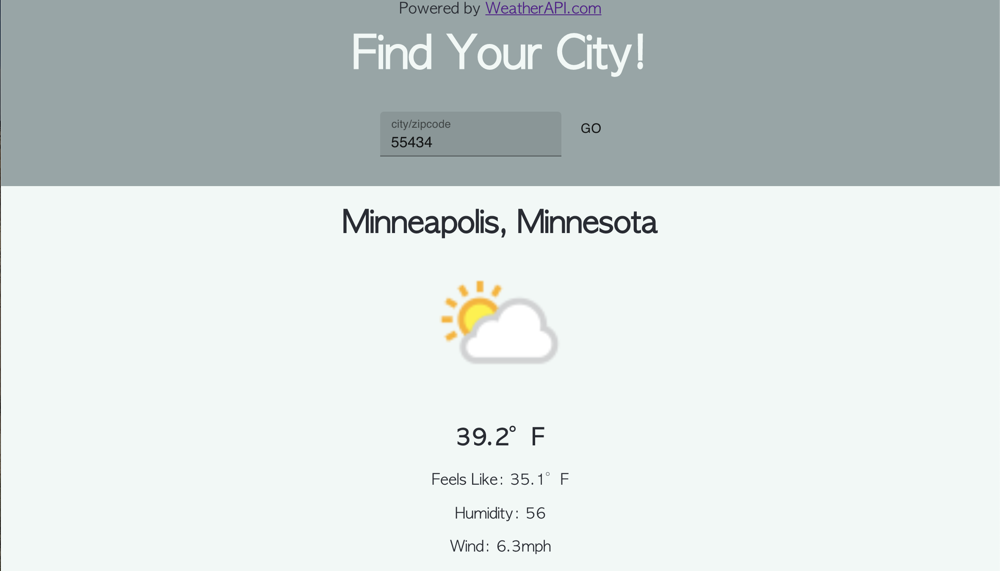
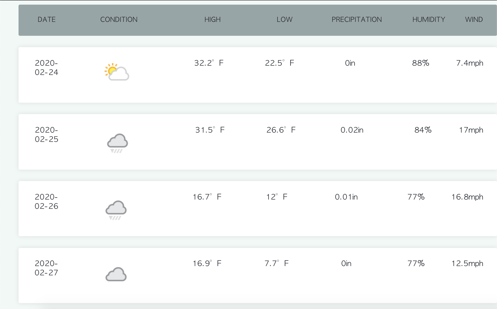

# Weather App Code Challenge

## Description

Welcome to the my weather app! This application is powered by Weather API. At the top, users can input a city name or zipcode. Upon submitting, the forecast for the current day and next 3 days will be displayed below.

## View Deployed:
https://hayleyhollermann.github.io/weather-app-challenge/

## Screen Shot

## Built With
- Visual Studio Code
- Weather API: https://www.weatherapi.com/weather/
- React.js
- React-Redux
- Redux-Sagas
- Material-UI
- Node Version 12.11.1

## Steps to Run
1. Clone this repository
2. Navigate to the project directory in your terminal
3. Run the Following scripts:
    - `npm install` - install the necessary dependencies 
    - `npm run server` - runs server (localhost:5000)
    - `npm run client` - runs client (localhost:3000)
4. Set up API key
    1. Go to https://www.weatherapi.com/signup.aspx to create an account or sign in
        - Free account is fine
    2. Once logged in, on the user homepage at the top will be the API key
5. Create a .env file in the home directory of the project 
    - **Make sure `.env` is listed in the .gitignore file**
    - In the .env file enter this line: `WEATHER_API_KEY={YOUR_API_KEY_HERE}` and insert your unique API code.

## Acknowledgement
Thanks to Homespotter for giving me this code challenge.

## Support
If you have suggestions or issues, please email me at hayleyhollermann.com